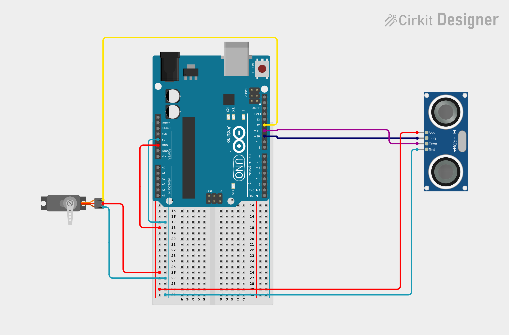
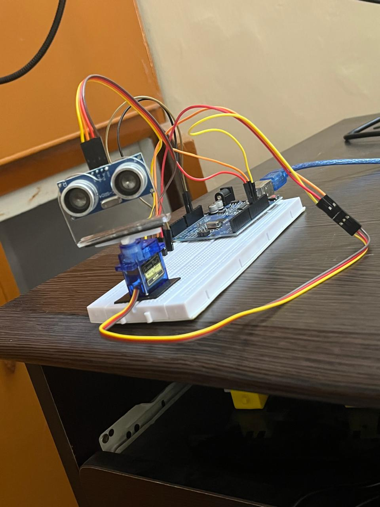

# Radar-Sensor-
# 📡 Arduino Ultrasonic Radar System

A servo-driven ultrasonic radar system built with an Arduino Uno. An HC-SR04 ultrasonic sensor is mounted on a servo motor to sweep across a 180° field of view, measuring distance at each angle to detect nearby objects across its sweep path. Designed, wired, and simulated using Cricut Design Space (or your preferred designer layout).

---

## 🖼️ Preview

*Crikit Designer circuit — Arduino Uno, HC-SR04, servo motor, .*

*The circuit built and tested on real hardware.*

---

## ⚙️ How It Works

⚙️ How It Works
1. The servo motor sweeps the radar sensor across a 0°–180° arc to continuously scan the surrounding area.

2. At each angle, the Arduino signals the radar sensor to transmit a wave signal (ultrasonic or microwave) toward the target field.

3. The radar sensor captures the signal reflecting off any nearby obstacle and sends the raw response back to the Arduino.

4. The Arduino processes the signal delay to calculate the exact distance to the detected object at that specific angle.

5. The angle and distance data are continuously sent via serial communication to a connected display or software (like Processing) to draw a real-time radar screen.

---

## ✨ Features

- 180° radar-style object scanning using a servo-mounted ultrasonic sensor
- Real-time distance measurement with the HC-SR04
- Fully simulated and testable in CrikitDesigner before physical assembly
- Simple, beginner-friendly embedded systems project built entirely on an Arduino Uno

---

## 🧰 Components Used

| Component                | Quantity | Purpose                                  |
|---------------------------|:--------:|-------------------------------------------|
| Arduino Uno R3             | 1        | Main microcontroller                      |
| HC-SR04 Ultrasonic Sensor  | 1        | Distance measurement                      |
| Micro Servo Motor (SG90)   | 1        | Sweeps the sensor across 180°             |
| Breadboard                  | 1        | Prototyping the buzzer/LED circuit        |
| Jumper Wires                 | —        | Circuit connections                       |
| USB Cable                    | 1        | Power + programming the Arduino           |

---

## 🔌 Pin Connections

| Component        | Pin  | Arduino Pin |
|-------------------|------|-------------|
| HC-SR04            | VCC  | 5V          |
| HC-SR04            | GND  | GND         |
| HC-SR04            | TRIG | D10         |
| HC-SR04            | ECHO | D11         |
| Servo Motor         | PWR         | 5V   |
| Servo Motor         | GND         | GND  |
| Servo Motor         | SIG         | D12  |

---

## 🚀 Getting Started

### Step 1 — Simulate on Crikit Designer
1. Open the project on Crikit Designer:`
2. Click **Start Simulation** to see the radar sweep and proximity alerts in action.

### Step 2 — Build the Physical Circuit
1. Connect all the Components as shown in the circuit image above.
2. Connect the Arduino Uno to your computer via USB.
3. Open `Arduino Code` in the Arduino IDE.
4. Select **Tools > Board > Arduino Uno** and the correct COM port.
5. Click **Upload**.
6. Open the **Serial Monitor** (or **Serial Plotter**) at 9600 baud to view live distance readings.

---

## 🎥 Demo — Detection in Action

| Object Detected |
|:---:|
|  |
| Object within threshold — LED + buzzer alert active |

---

## 👤 Author

**Muhammad Hassan**
Electrical Engineering Student, PIEAS

---

## 📄 License

This project is open-source and available for all .
